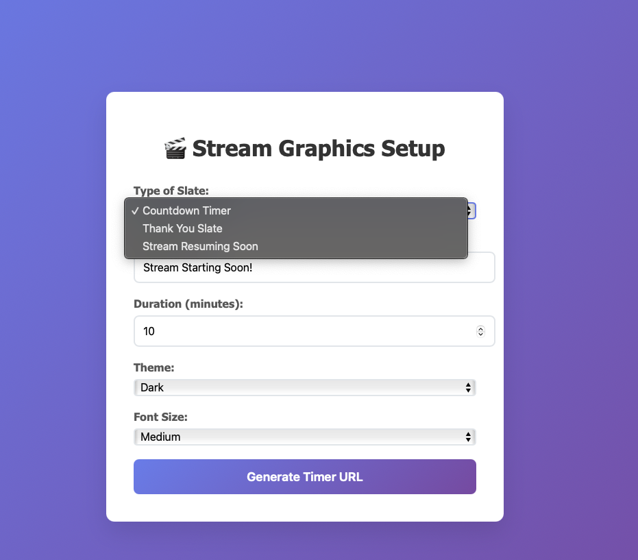
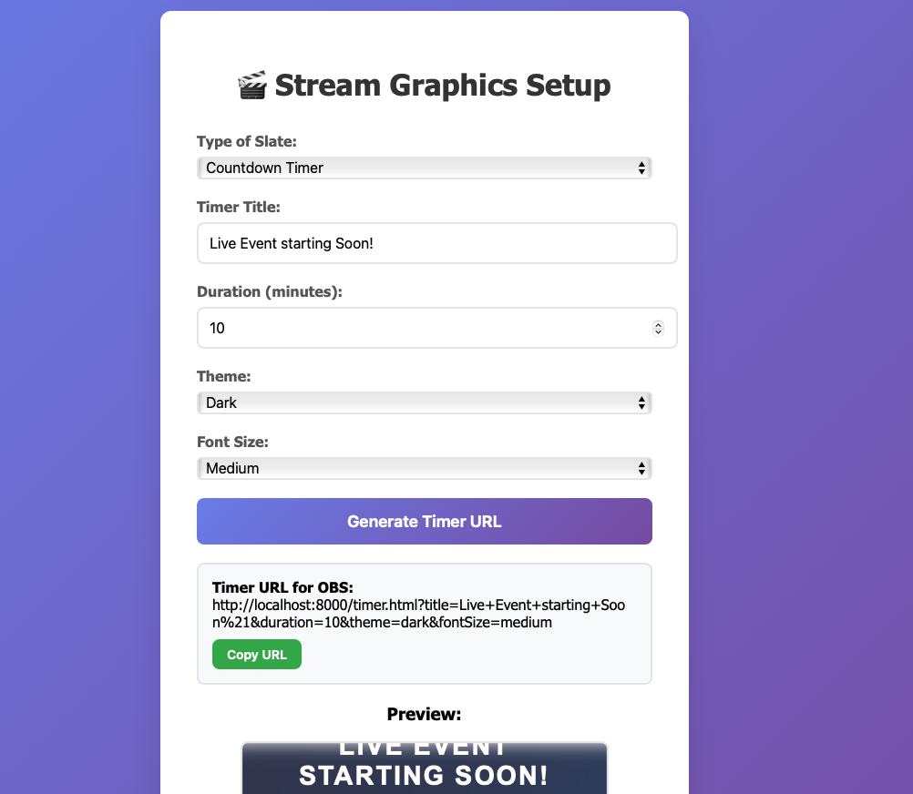
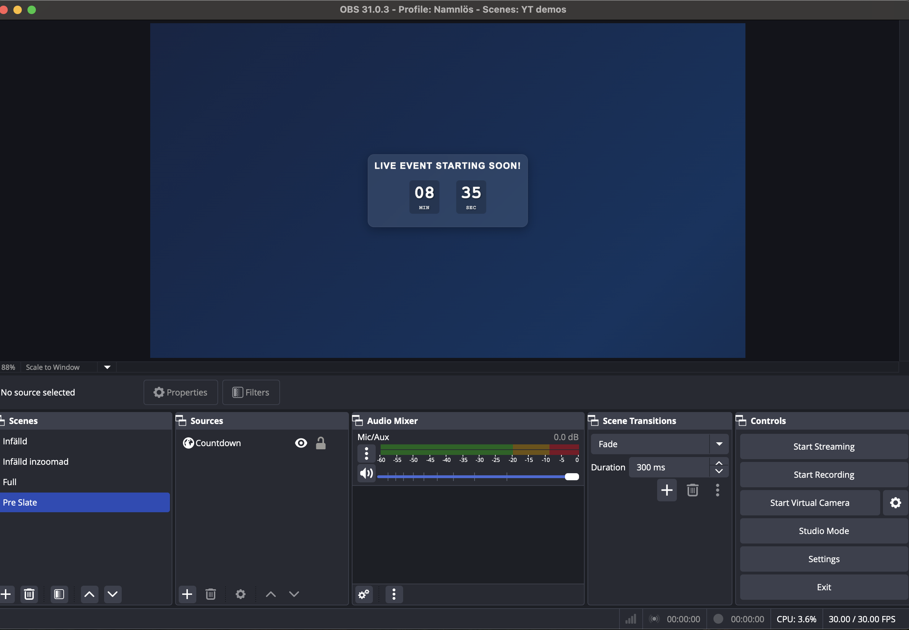

# Stream Graphics Generator

A web application for creating beautiful countdown timers and overlay slates for live streaming. Perfect for use with OBS Studio browser sources.



## Screenshots

<div align="center">

### Countdown Timer Examples


### OBS Studio Integration


</div>

## Features

### 🕒 Countdown Timer
- Customizable timer duration (1-999 minutes)
- Countdown display with minutes and seconds
- Automatically shows "LIVE NOW!" when timer reaches zero
- Clean, professional appearance

### ✨ Thank You Slate
- Customizable thank you message
- Optional sub-message
- Social media icons (X/Twitter, LinkedIn, YouTube, Twitch)
- Perfect for end-of-stream displays

### ⏰ Stream Resuming Soon Slate
- Quick break announcements
- Customizable messages
- Ideal for short intermissions

### 🎨 10 Beautiful Themes
- **Dark** - Professional dark gradient
- **Light** - Clean light theme
- **Neon Cyan** - Vibrant neon effect with glow
- **Minimal** - Simple black and white
- **Sunset Orange** - Warm orange gradients
- **Forest Green** - Natural green tones
- **Purple Galaxy** - Deep space purples
- **Ocean Blue** - Cool ocean blues
- **Fire Red** - Dynamic red and orange
- **Gold Luxury** - Rich golden theme

### ✨ Visual Effects
- Smooth animated gradient backgrounds
- Floating animations
- Fade-in effects
- Responsive design for all screen sizes
- Font size options (Small, Medium, Large, Extra Large)

## Quick Start

1. **Download or Clone**
   ```bash
   git clone https://github.com/yourusername/stream-graphics-generator.git
   cd stream-graphics-generator
   ```

2. **Start a Local Server**
   ```bash
   # Using Python 3
   python3 -m http.server 8000
   
   # Using Node.js (if you have http-server installed)
   npx http-server
   
   # Using PHP
   php -S localhost:8000
   ```

3. **Open in Browser**
   Navigate to `http://localhost:8000`

4. **Configure Your Slate**
   - Choose your slate type (Timer, Thank You, or Resuming)
   - Customize messages and settings
   - Select theme and font size
   - Generate URL

5. **Add to OBS**
   - Copy the generated URL
   - In OBS, add a "Browser Source"
   - Paste the URL
   - Set width: 1920, height: 1080 (or your stream resolution)

## File Structure

```
stream-graphics-generator/
├── index.html          # Configuration interface
├── timer.html          # Countdown timer display
├── slate.html          # Thank you & resuming slates display
├── README.md           # This file
└── LICENSE             # MIT license
```

## Usage Examples

### Countdown Timer
Perfect for "Stream Starting Soon" overlays:
- Set duration (e.g., 10 minutes)
- Choose theme and title
- Use URL in OBS browser source

### Thank You Slate
Great for end-of-stream displays:
- Customize thank you message
- Add social media icons
- Show at stream end

### Resuming Soon Slate
Ideal for quick breaks:
- "Be Right Back" messages
- Technical difficulty announcements
- Short intermissions

## Browser Compatibility

Works in all modern browsers:
- Chrome/Chromium
- Firefox
- Safari
- Edge

## OBS Studio Setup

1. Add **Browser Source** to your scene
2. Set URL to your generated link
3. Recommended settings:
   - Width: 1920
   - Height: 1080
   - Use hardware acceleration when available
   - Shutdown source when not visible: ✓
   - Refresh browser when scene becomes active: ✓

## Customization

All graphics are highly customizable through the web interface:
- **Messages**: Change any text content
- **Themes**: 10 pre-built color schemes
- **Font Sizes**: 4 size options
- **Social Media**: Toggle individual platforms
- **Duration**: Set any timer length

## Contributing

Contributions are welcome! Please feel free to submit a Pull Request.

1. Fork the repository
2. Create your feature branch (`git checkout -b feature/AmazingFeature`)
3. Commit your changes (`git commit -m 'Add some AmazingFeature'`)
4. Push to the branch (`git push origin feature/AmazingFeature`)
5. Open a Pull Request

## License

This project is licensed under the MIT License - see the [LICENSE](LICENSE) file for details.

## Copyright

Copyright (c) 2024 Jonas Birmé

## Acknowledgments

- Built for the streaming community
- Designed to work seamlessly with OBS Studio
- Inspired by the need for beautiful, professional stream graphics

---

**Made with ❤️ for streamers by streamers**